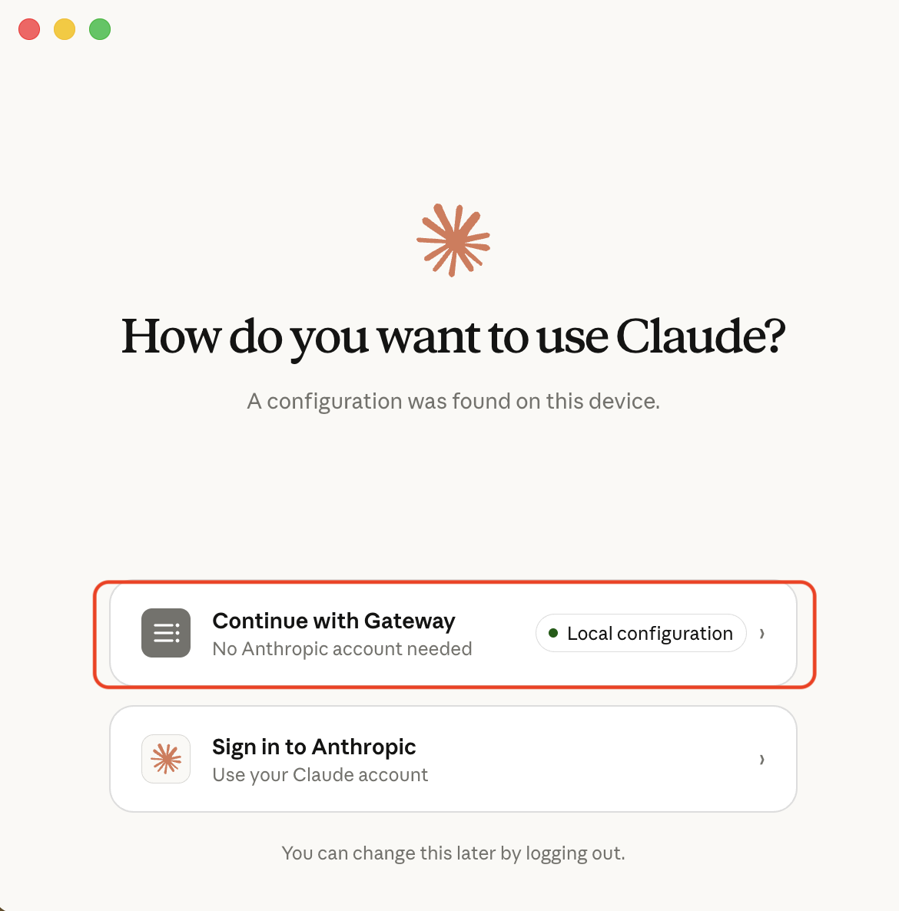
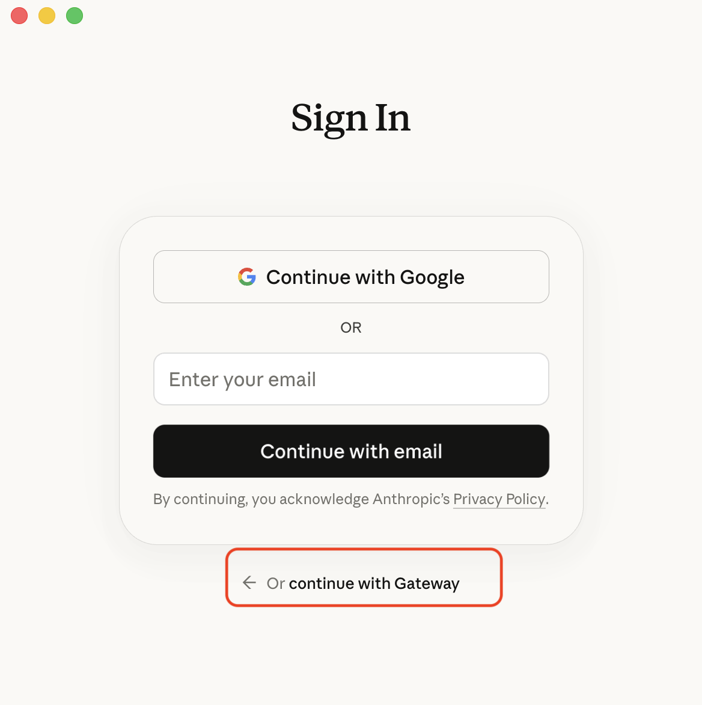
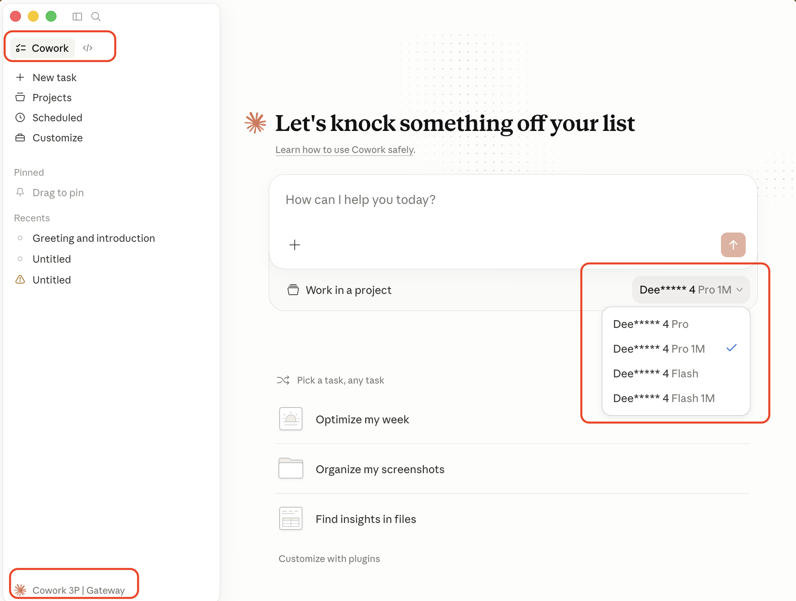
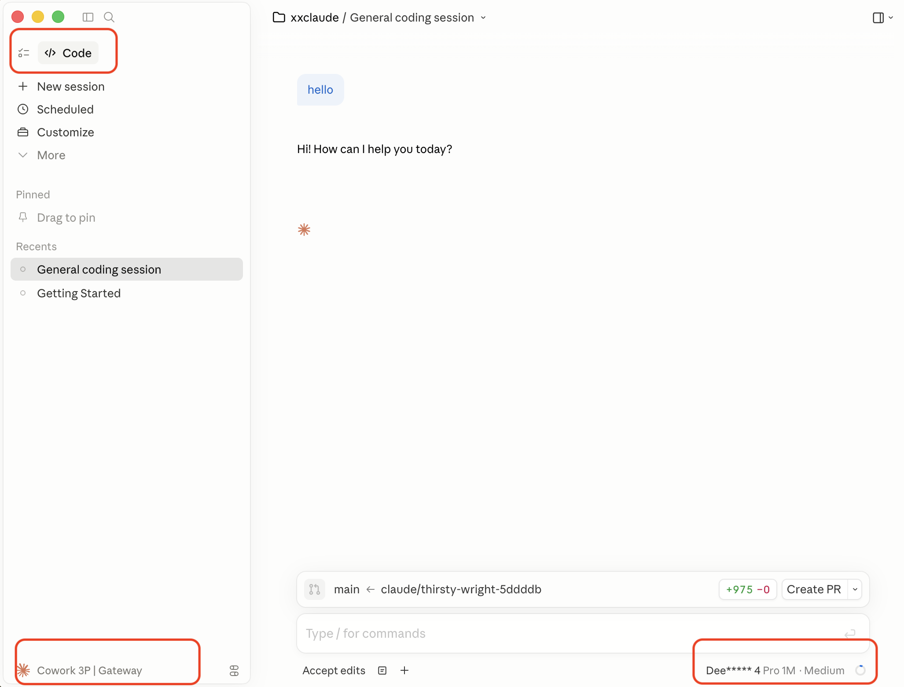

# dsclaude — 面向其他模型后端的 Claude Code & Claude Desktop 启动器

[English](README.md)

一套小巧的 Shell 脚本，让 [Claude Code](https://claude.ai/code) 和 Claude Desktop 指向非 Anthropic 的模型后端。

## 脚本列表

| 脚本 | Agent | 平台 | 后端 | 模型 |
|------|-------|------|------|------|
| **[dsclaude](dsclaude)** | Claude Code (CLI) | macOS / Linux | DeepSeek API（Anthropic 兼容端点） | `deepseek-v4-pro[1m]`（默认，统一推理）· `deepseek-v4-flash[1m]`（快速 / haiku 档位） |
| **[dsclaude-desktop](dsclaude-desktop)** | Claude Desktop (GUI) | macOS | DeepSeek API（Anthropic 兼容端点） | `deepseek-v4-pro` · `deepseek-v4-flash`（均启用 1M 上下文） |
| **[dsclaude-desktop.ps1](dsclaude-desktop.ps1)** | Claude Desktop (GUI) | Windows（未实测） | DeepSeek API（Anthropic 兼容端点） | 同上 |

`dsclaude` 会在 Claude Code 的 `/model` 选择器中暴露备选模型，支持会话中热切换；同时设置 `ANTHROPIC_DEFAULT_HAIKU_MODEL`，让后台/轻量任务走快模型；并支持可选的环境变量覆盖上下文窗口和输出 token 上限。

`dsclaude-desktop` 是 Claude Desktop **内置** "Configure Third-Party Inference" 功能（Developer 菜单）的一键配置工具。它把对话框需要你手填的那份 JSON 配置直接写好（已为 DeepSeek 预填）并重启 App。Anthropic 模式 ↔ Gateway 模式之间的切换由 Claude Desktop 启动选择器原生支持，所以脚本里没有 `--revert`。

## 兼容性

| 平台 | 支持状态 |
|------|----------|
| macOS | 原生支持，完全可用 |
| Linux (Ubuntu 等) | 兼容 — 依赖 `bash` 和标准 POSIX 工具（系统自带） |
| Windows | 不原生支持 — 可通过 [WSL](https://learn.microsoft.com/zh-cn/windows/wsl/) 或 Git Bash 运行 |

## 快速开始

```bash
git clone https://github.com/Agents365-ai/dsclaude.git
cd dsclaude
chmod +x dsclaude
```

可选 — 设为全局命令：

```bash
sudo mv dsclaude /usr/local/bin/
```

### dsclaude

遵循 DeepSeek 官方指南：[Integrate with Coding Agents](https://api-docs.deepseek.com/guides/coding_agents) / [Anthropic API](https://api-docs.deepseek.com/guides/anthropic_api)。

```bash
export DEEPSEEK_API_KEY=sk-xxxxxxxxxxxxxxxxxx   # 添加到 ~/.zshrc 或 ~/.bashrc

dsclaude                 # 以 deepseek-v4-pro 启动（默认，完整推理能力）
dsclaude fast            # 以 deepseek-v4-flash[1m] 启动（更便宜/更快）
dsclaude long            # 申请 1M 上下文窗口（1,048,576 tokens）
dsclaude long fast       # 1M + flash
```

脚本会自动按 DeepSeek 官方建议导出全套环境变量：`ANTHROPIC_BASE_URL=https://api.deepseek.com/anthropic`、Opus/Sonnet/Haiku 模型映射、`CLAUDE_CODE_SUBAGENT_MODEL` 以及 `CLAUDE_CODE_EFFORT_LEVEL=max`（可用 `DSCLAUDE_EFFORT` 覆盖）。

会话中切换：`/model deepseek-v4-flash[1m]` ↔ `/model deepseek-v4-pro[1m]`。

> **注意：** `deepseek-v4-pro` 和 `deepseek-v4-flash` 均原生支持 1M token 上下文窗口。在 Claude Code 中，两个模型都需要加 `[1m]` 后缀来开启（`deepseek-v4-pro[1m]`、`deepseek-v4-flash[1m]`）。`dsclaude` 已自动完成此设置。

### dsclaude-desktop

Claude Desktop **内置**第三方推理（Third-Party Inference）功能的一键配置工具，已为 DeepSeek 预填好。

**这不是 hack 或破解。** Anthropic 在 Claude Desktop 里直接提供了 "Configure Third-Party Inference" 对话框（Developer 菜单），允许你手动把 App 指向任意 Anthropic-compatible 端点。该对话框有 6 个必填字段 + 模型列表。`dsclaude-desktop` 帮你把那个对话框会写的 JSON 配置直接写到磁盘，然后重启 App —— 省下你手点菜单填表的时间。

#### 前置条件

1. **已安装 Claude Desktop**（[claude.ai/download](https://claude.ai/download)）
2. **已启用 Developer Mode**
   - 路径：Help → Troubleshooting → Enable Developer Mode
   - 一次即可。脚本每次运行会自动校验。
3. **DeepSeek API Key** 在 `$DEEPSEEK_API_KEY` / shell rc 文件里，或运行时弹框输入

#### 用法

```bash
export DEEPSEEK_API_KEY=sk-xxxxxxxxxxxxxxxxxx   # 添加到 ~/.zshrc 或 ~/.bashrc

./dsclaude-desktop      # 配置并重启 Claude Desktop
./dsclaude-desktop -h   # 帮助
```

脚本做的事：
1. 在 `~/Library/Application Support/Claude-3p/configLibrary/` 下生成一个 entry 文件，内容为：你的 DeepSeek key、base URL `https://api.deepseek.com/anthropic`、auth scheme `bearer`、模型列表 `deepseek-v4-pro` + `deepseek-v4-flash`（均启用 1M context）
2. 把 `_meta.json` 的 `appliedId` 指向这个 entry（你之前通过 GUI 配的其他 entry 不动）
3. `killall Claude && open -a Claude` 让 App 重新加载配置

#### 模式切换

Claude Desktop 启动选择器原生支持模式切换，所以脚本不需要 `--revert`：

<p align="center">
  
</p>

即使在 Anthropic 登录页也能直接跳回 Gateway：

<p align="center">
  
</p>

切换方式：在 Claude Desktop 里点头像 → Disconnect（或登出） → 下次启动时挑另一个入口。

#### 配置成功后的样子

Gateway 模式下 **Cowork** 和 **Code** 都走 DeepSeek。模型选择器里能看到你的（脱敏显示的）DeepSeek 模型：

<p align="center">
  
</p>

<p align="center">
  
</p>

> **唯一不可用的功能**：经典 **Chat**（claude.ai 风格对话）。Chat 依赖 Anthropic 托管的服务（memory / projects / artifacts / 联网搜索），这些不在 inference API 表面上，第三方 gateway 拿不到。要用 Chat 就在启动选择器选 Anthropic 模式即可。

#### Windows 版本

`dsclaude-desktop.ps1` 是 PowerShell 端口。Schema 和流程完全相同：

```powershell
$env:DEEPSEEK_API_KEY = "sk-xxxxxxxxxxxxxxxxxx"
pwsh ./dsclaude-desktop.ps1
```

前置条件与 macOS 版相同：Claude Desktop 已安装、Developer Mode 已启用、有 DeepSeek API Key。配置目录是 `%APPDATA%\Claude-3p\configLibrary\`（而非 macOS 的 `~/Library/Application Support/Claude-3p/configLibrary/`）。

> **作者未在 Windows 上实测过。** Schema 和那些坑（末尾换行、UUID 小写、Developer Mode 门控）都是 macOS 上发现的；Anthropic 在 Windows 上跑的是同一份 Electron App，理论上一致，但请在 [issue 区](https://github.com/Agents365-ai/dsclaude/issues) 反馈任何异常。

## 开源协议

MIT

## 赞赏支持

如果这些脚本为你节省了时间，欢迎支持作者：

<table>
  <tr>
    <td align="center">
      
      <br>
      <b>微信支付</b>
    </td>
    <td align="center">
      
      <br>
      <b>支付宝</b>
    </td>
    <td align="center">
      
      <br>
      <b>Buy Me a Coffee</b>
    </td>
    <td align="center">
      
      <br>
      <b>打赏鼓励</b>
    </td>
  </tr>
</table>

## 作者

**Agents365-ai**

- 哔哩哔哩：https://space.bilibili.com/441831884
- GitHub：https://github.com/Agents365-ai
